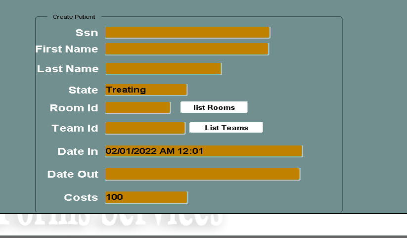
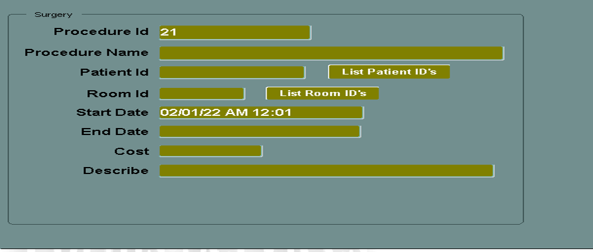
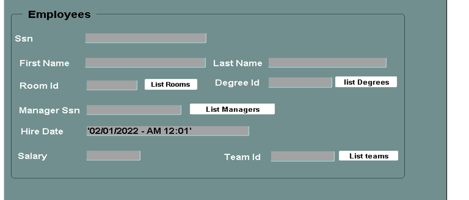
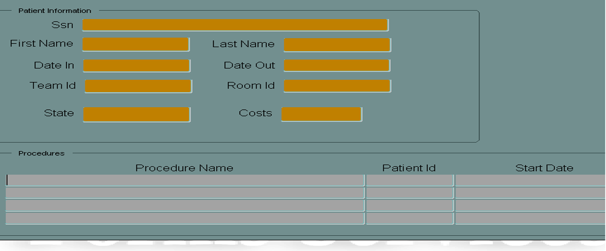

# Oracle Forms
----
## Hospital Management System

Hospital system are a huge system that take months to build it to be full system after days and days from studying all aspects and make the system goes will.✔

In my humble project I give part of hospital system that can by developed and maintain in easy way.⏩

I my database consist of 7 tables, 5 sequences and 3 views.🧵

**Tables** are created to save data and gathering information's.📑

**Sequences** created to create primary keys for deferent tables and sure that data have consistency between each other.⛓

**Views** to collection data from tables and view it in form! 📸

### Create database 🏗

To `**Create**` tables by run BuildDB.sql

To `**insert**` tables data , add constraints, sequences and views InhibitDB.sql 

To `**Delete**` all tables with it's data DropDB.sql

To `**Delete**` data from tables ClearDB.sql

-----

### Forms Look Like:

#### Insert patient 

#### Create Surgery 

#### Add an employee

#### list patient schedule surgeries

## END

